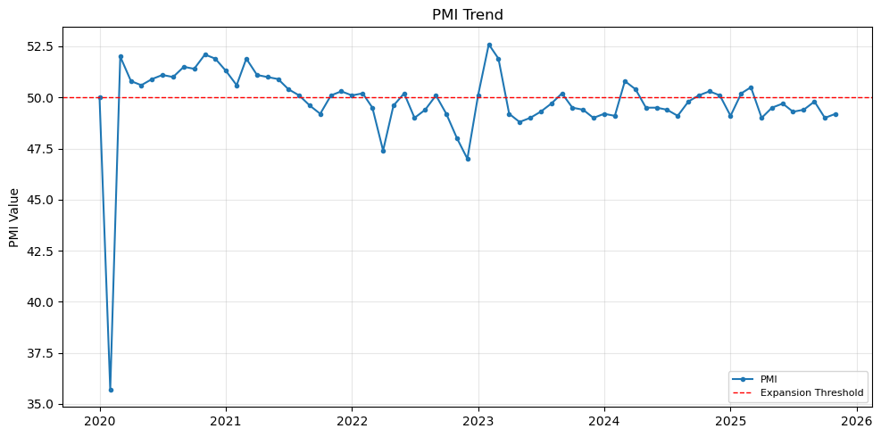
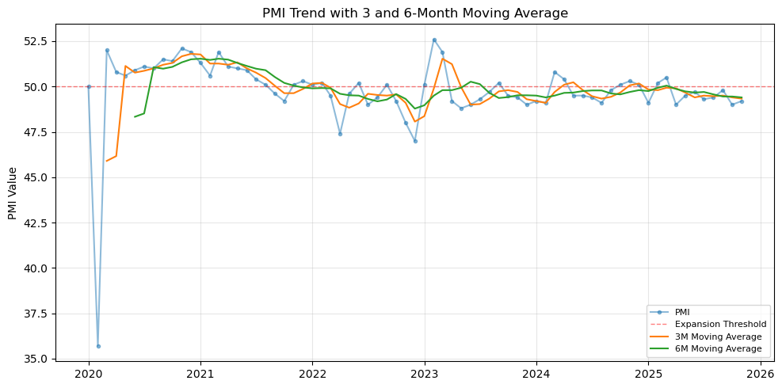
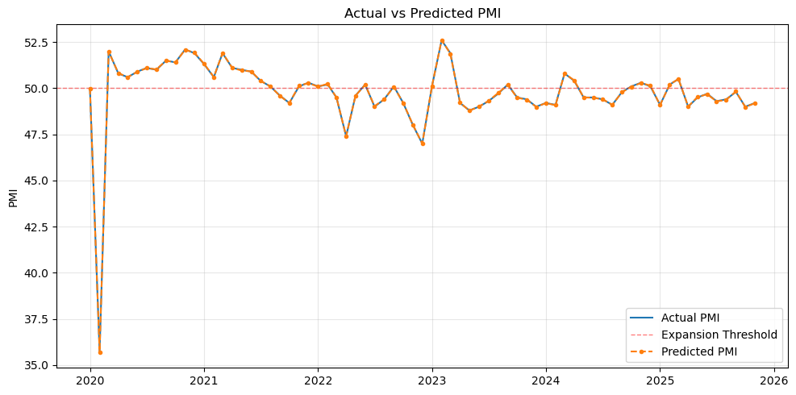
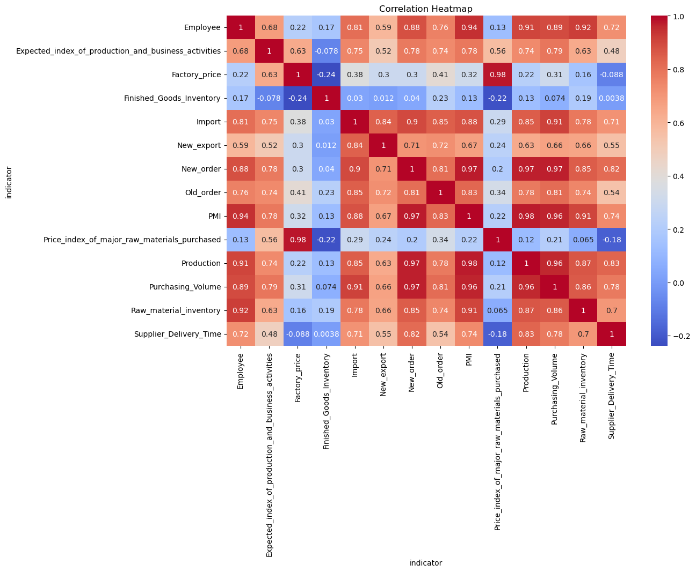
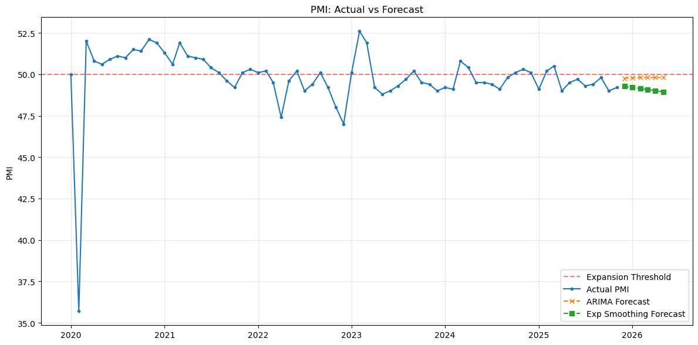

# PMI-Macro-Analysis
# Project Overview
This project analyzes five years of PMI and macroeconomic indicators to evaluate whether PMI can serve as a leading indicator for future economic performance. Time-series forecasting models including ARIMA and Holt-Winters Exponential Smoothing were applied to capture trends and seasonality, enabling data-driven forecasting and decision-making.

# Goals
- Clean raw macroeconomic data
- Explore trends and correlations
- Build regression models
- Generate automated visual reports

# Tech Stack
- Python (Pandas, NumPy, Matplotlib, Seaborn, Statsmodels)
- Time-Series Forecasting (ARIMA)
- Regression & Correlation Analysis
- Jupyter Notebook

# Key Results
- Generated 6-month forecasts
- Reduced manual analysis time by 70%
- Built automated visualization pipeline

# Sample Visualizations

# How to Run
- pip install -r requirements.txt
- jupyter notebook
